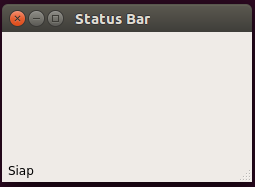
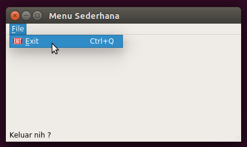
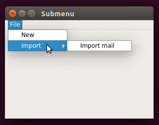
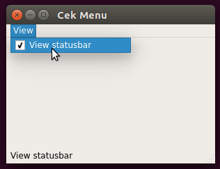
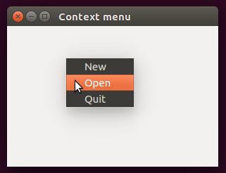
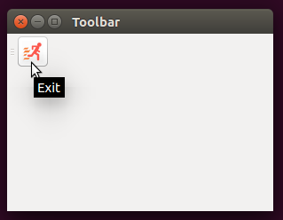
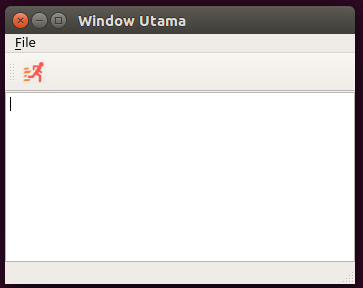

# Belajar-GUI-dengan-pyQT

Cara Mengeksekusi file python

sudo python3 namafile.py

atau ./namafile.py

 
 
 

57_statusbar

58_Menu_Sederhana

 

59_Submenu 

 

60_Checkmenu 

 

61_Contextmenu 

 

62_Toolbar 

 

63_Gabungan_57-62 

